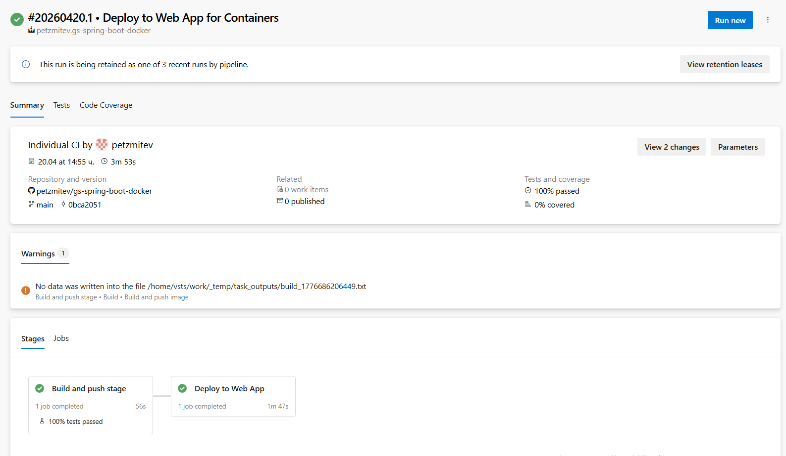
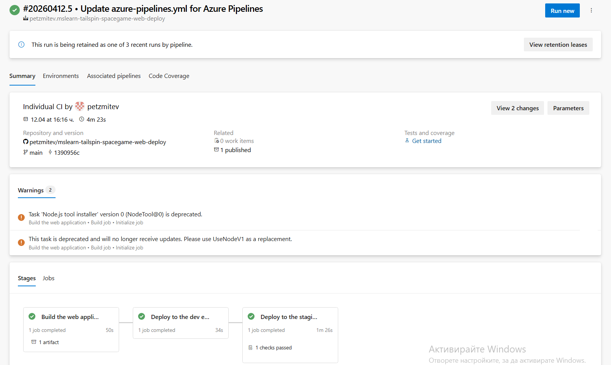

# DevOps CI/CD Showcase

A collection of GitHub Actions workflows and Azure DevOps pipelines created during hands-on practice and learning.

This repository demonstrates modern CI/CD concepts, including automated builds, testing, Docker image publishing, Azure deployments, and multi-stage release pipelines.

---

# Repository Structure

```
devops-cicd-showcase/
│
├── github-actions/
│   ├── python-package.yml
│   ├── python-coverage.yml
│   ├── docker-publish.yml
│   ├── deploy-staging.yml
│   ├── deploy-production.yml
│   └── configure-azure-environment.yml
│
├── azure-devops/
│   ├── multi-stage-webapp-deploy.yml
│   └── springboot-docker-webapp.yml
│
├── screenshots/
│   ├── azure-devops-springboot-deployment.png
│   └── azure-devops-multistage-pipeline.png
│
├── LICENSE
└── README.md
```

---

# GitHub Actions

The repository includes GitHub Actions workflows demonstrating:

- Python package build
- Python test coverage
- Docker image build and publish to GitHub Container Registry (GHCR)
- Azure staging deployment
- Azure production deployment
- Azure environment provisioning

---

# Azure DevOps Pipelines

## Multi-stage Web Application Deployment

Pipeline stages:

- Build
- Deploy to Development
- Deploy to Staging

---

## Spring Boot Docker Deployment

Pipeline stages:

- Build Maven project
- Build Docker image
- Push image to Azure Container Registry (ACR)
- Deploy container to Azure Web App

---

# Technologies

- GitHub Actions
- Azure DevOps Pipelines
- Docker
- GitHub Container Registry (GHCR)
- Azure Container Registry (ACR)
- Azure App Service
- Java
- Spring Boot
- Maven
- YAML

---

# Pipeline Results

The screenshots below show successful Azure DevOps pipeline executions completed during hands-on exercises.

### Spring Boot Docker Deployment



### Multi-stage Azure DevOps Pipeline



---

# Purpose

This repository serves as a portfolio project demonstrating practical experience with CI/CD automation, GitHub Actions, Azure DevOps, Docker, and cloud deployment workflows.

---

# Author

**Peter Mitev**

Computer and Software Engineering student with interests in:

- DevOps
- Cloud Computing
- DevSecOps
- Cybersecurity
